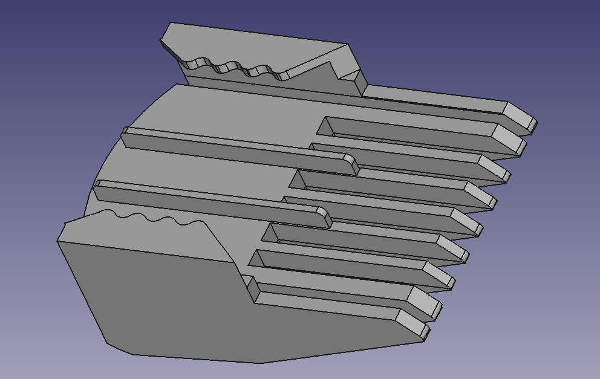
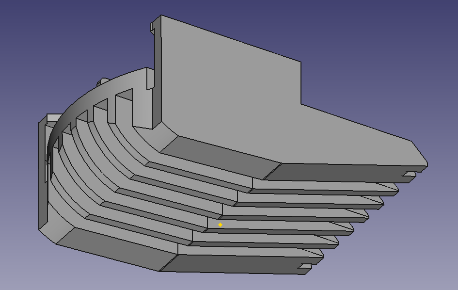

# Conair GMT8R spare comb

General information
 
<ul>
	<li>Made with FreeCAD.</li>
	<li>It's the biggest comb of the kit.</li>
	<li>I made this because I needed a spare part (because my dog ate the original one XD).</li>
	<li>General dimensions: Length: 55.0 mm, width: 37.0 mm, height: 22.0 mm.</li>
<ul>
 
<h4>Model preview</h4>

 

